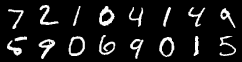
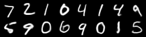

# vae
This mini VAE implementation corresponds to the blog post [Yet Another Variational Autoencoders Tutorial](https://toddmorrill.github.io/machine%20learning/vae/) using the MNIST dataset.

## Running the code
To run the model with an **MSE loss function**, use the following command:
```bash
python3 vae.py \
    --mse=1 \
    --data_path='/home/iron-man/.cache/torch/mnist/'
```
To run the model with a **binary cross-entropy loss function**, use the following command:
```bash
python3 vae.py \
    --mse=0 \
    --sigmoid=1 \
    --data_path='/home/iron-man/.cache/torch/mnist/'
```

Both loss functions with save an input sample of MNIST images and the corresponding reconstructed images, which will look like the following.

**Input images**



**Output images**

